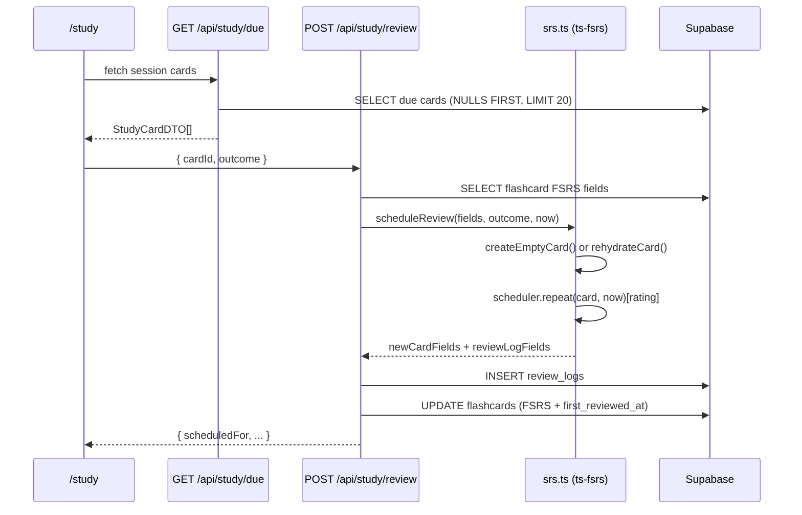

# ts-fsrs Reference for S-04 (srs-review-session)

> Consolidated documentation for implementing the SRS review session slice.
> Package version in this repo: **ts-fsrs@5.4.1** (`src/lib/services/srs.ts`).

## Official documentation

| Resource | URL |
|---|---|
| README (start here) | [packages/fsrs/README.md](https://github.com/open-spaced-repetition/ts-fsrs/blob/main/packages/fsrs/README.md) |
| TypeDoc API | [open-spaced-repetition.github.io/ts-fsrs](https://open-spaced-repetition.github.io/ts-fsrs/) |
| FSRS class | [FSRS class docs](https://open-spaced-repetition.github.io/ts-fsrs/classes/FSRS.html) |
| npm package | [ts-fsrs@5.4.1](https://www.npmjs.com/package/ts-fsrs) |
| Algorithm wiki | [FSRS algorithm](https://github.com/open-spaced-repetition/fsrs4anki/wiki/The-Algorithm) |
| Full-stack demo | [ts-fsrs-demo](https://github.com/ishiko732/ts-fsrs-demo) |

**Requirements:** Node.js ≥ 20. Pure TypeScript — Workers-compatible (no native addons).

---

## S-04 outcome → ts-fsrs mapping

From `context/foundation/roadmap.md` S-04:

> User can start a study session, see SR-scheduled cards, grade each (again/hard/good/easy), and have the schedule updated without losing history.

| S-04 need | ts-fsrs API | Implementation in this repo |
|---|---|---|
| New card (never reviewed) | `createEmptyCard(now?)` | `fsrs_state IS NULL` → `createEmptyCard(now)` |
| Grade a review | `scheduler.next(card, now, Rating.Good)` | `scheduler.repeat(card, now)[rating]` |
| Four outcomes | `Rating.Again/Hard/Good/Easy` (1–4) | `mapOutcomeToRating()` in `src/lib/services/srs.ts` |
| Card lifecycle states | `State.New/Learning/Review/Relearning` (0–3) | stored as `fsrs_state` |
| Next due date | `card.due: Date` | `fsrs_due` (ISO timestamptz) |
| Immutable history | `RecordLogItem.log` | `review_logs` table |
| Due-card selection | `card.due <= now` | SQL: `fsrs_due IS NULL OR fsrs_due <= NOW()` |

---

## Core types (v5.4.1)

### `Card` — persisted on `flashcards`

```ts
interface Card {
  due: Date;              // → fsrs_due
  stability: number;      // → fsrs_stability
  difficulty: number;     // → fsrs_difficulty (1–10)
  scheduled_days: number; // → fsrs_scheduled_days
  learning_steps: number; // → fsrs_learning_steps
  reps: number;           // → fsrs_reps
  lapses: number;         // → fsrs_lapses
  state: State;           // → fsrs_state (0–3)
  last_review?: Date;     // → fsrs_last_review
  elapsed_days: number;   // ⚠️ deprecated — do NOT persist (removed in v6)
}
```

### `Rating` — maps to UI buttons

| UI | Enum | Value |
|---|---|---|
| Again | `Rating.Again` | 1 |
| Hard | `Rating.Hard` | 2 |
| Good | `Rating.Good` | 3 |
| Easy | `Rating.Easy` | 4 |

(`Rating.Manual = 0` exists but S-04 does not use it.)

### `State` — card lifecycle

| State | Value |
|---|---|
| `State.New` | 0 |
| `State.Learning` | 1 |
| `State.Review` | 2 |
| `State.Relearning` | 3 |

### `RecordLogItem` — result of one grade

```ts
type RecordLogItem = {
  card: Card;   // new scheduling state → UPDATE flashcards
  log: ReviewLog; // audit snapshot → INSERT review_logs
};

interface ReviewLog {
  rating: Rating;
  state: State;        // pre-review state (important for history)
  due: Date;
  stability: number;
  difficulty: number;
  scheduled_days: number;
  learning_steps: number;
  review: Date;        // when the grade happened
}
```

---

## Minimal integration pattern

### 1. Install & initialize

```ts
import { createEmptyCard, fsrs, generatorParameters, Rating } from "ts-fsrs";

const scheduler = fsrs(generatorParameters()); // defaults: 90% retention, short-term steps on
```

**Default parameters** (from type defs):

- `request_retention`: `0.9`
- `maximum_interval`: `36500` days
- `enable_fuzz`: `false`
- `enable_short_term`: `true`
- `learning_steps`: `['1m', '10m']`
- `relearning_steps`: `['10m']`

S-04 uses **defaults** — no user-configurable FSRS params.

### 2. New card vs rehydrated card

**Critical rule:** if `fsrs_state IS NULL`, the card was never reviewed — use `createEmptyCard()`, do not rehydrate from NULL columns.

```ts
const card = isNew
  ? createEmptyCard(now)
  : rehydrateFromDbFields(fsrsColumns);
```

See `rehydrateCard()` in `src/lib/services/srs.ts`.

### 3. Apply a grade — two equivalent approaches

**Option A — `next()`** (when you already know the rating):

```ts
const result = scheduler.next(card, now, Rating.Good);
// result.card → persist to flashcards
// result.log  → append to review_logs
```

**Option B — `repeat()`** (preview all four, then pick one):

```ts
const preview = scheduler.repeat(card, now);
const result = preview[Rating.Good];
```

This repo uses `repeat()` and indexes by rating — functionally equivalent to `next()` for a known outcome.

### 4. Persist with `afterHandler` (optional cleaner mapping)

From the README — avoids manual Date ↔ ISO conversion:

```ts
const saved = scheduler.next(card, now, Rating.Good, ({ card, log }) => ({
  card: {
    ...card,
    due: card.due.toISOString(),
    last_review: card.last_review?.toISOString() ?? null,
  },
  log: {
    rating: log.rating,
    state: log.state,
    stability: log.stability,
    difficulty: log.difficulty,
    scheduled_days: log.scheduled_days,
    reviewed_at: log.review.toISOString(),
  },
}));
```

---

## Database schema ↔ ts-fsrs

### `flashcards` FSRS columns (`20260610100000_add_fsrs_columns_to_flashcards.sql`)

| DB column | `Card` field | Notes |
|---|---|---|
| `fsrs_due` | `due` | NULL = new/unscheduled |
| `fsrs_stability` | `stability` | |
| `fsrs_difficulty` | `difficulty` | |
| `fsrs_scheduled_days` | `scheduled_days` | |
| `fsrs_learning_steps` | `learning_steps` | |
| `fsrs_reps` | `reps` | also useful for optimistic concurrency |
| `fsrs_lapses` | `lapses` | |
| `fsrs_state` | `state` | NULL = never reviewed |
| `fsrs_last_review` | `last_review` | |

### Due-card query

```sql
WHERE status = 'accepted'
  AND (fsrs_due IS NULL OR fsrs_due <= NOW())
ORDER BY fsrs_due ASC NULLS FIRST
LIMIT 20
```

New cards (`fsrs_due IS NULL`) appear first, then most overdue.

### `review_logs` — what to store from `log`

| Column | Source |
|---|---|
| `rating` | `log.rating` (1–4) |
| `state` | `log.state` (pre-review state) |
| `stability` | `log.stability` |
| `difficulty` | `log.difficulty` |
| `scheduled_days` | `log.scheduled_days` |
| `reviewed_at` | `log.review` |

Append-only — no UPDATE/DELETE policies.

---

## End-to-end review flow



---

## Advanced APIs (not needed for S-04 MVP)

| Method | Purpose |
|---|---|
| `get_retrievability(card, now)` | Show recall probability (analytics) |
| `rollback(card, log)` | Undo a review from history |
| `forget(card, now)` | Reset card to forgotten state |
| `reschedule(card, reviews)` | Rebuild state from imported logs |
| `next_state()` + `next_interval()` | Low-level simulation/analytics |
| `@open-spaced-repetition/binding` | Train custom `w` parameters from logs |

---

## Reference implementation

`src/lib/services/srs.ts`:

```ts
export function scheduleReview(
  currentFields: FSRSCardFields | null,
  outcome: ReviewOutcome,
  now: Date = new Date(),
): { newCardFields: FSRSCardFields; reviewLogFields: ReviewLogFields } {
  const isNew = currentFields?.fsrs_state == null;
  const card = isNew ? createEmptyCard(now) : rehydrateCard(currentFields);

  const rating = mapOutcomeToRating(outcome);
  const recordLog = scheduler.repeat(card, now) as unknown as Record<Rating, FSRSItem>;
  const item = recordLog[rating];

  return {
    newCardFields: cardToFields(item.card),
    reviewLogFields: {
      rating: item.log.rating,
      state: item.log.state,
      stability: item.log.stability,
      difficulty: item.log.difficulty,
      scheduled_days: item.log.scheduled_days,
      reviewed_at: item.log.review.toISOString(),
    },
  };
}
```

**Simpler alternative** using `next()`:

```ts
const item = scheduler.next(card, now, rating);
```

---

## Implementation checklist

1. `npm install ts-fsrs` (v5.4.1)
2. Migration: 9 `fsrs_*` columns on `flashcards` + due index
3. Migration: `review_logs` table (append-only RLS)
4. `src/lib/services/srs.ts` — `createEmptyCard` / rehydrate / `scheduleReview`
5. `GET /api/study/due` — due query with `NULLS FIRST`
6. `POST /api/study/review` — fetch card → `scheduleReview` → INSERT log → UPDATE card + `first_reviewed_at`
7. `/study` React island — flip card → four grade buttons
8. Map outcomes: `again→1, hard→2, good→3, easy→4`

---

## v6 migration note

`elapsed_days` and `last_elapsed_days` on `Card`/`ReviewLog` are **deprecated** and will be removed in ts-fsrs v6. Do not persist them in the schema.
